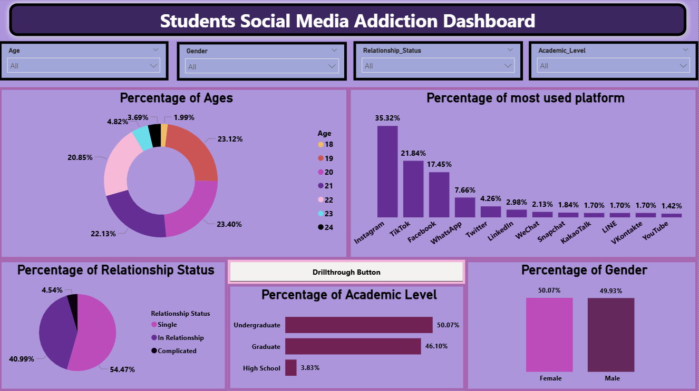
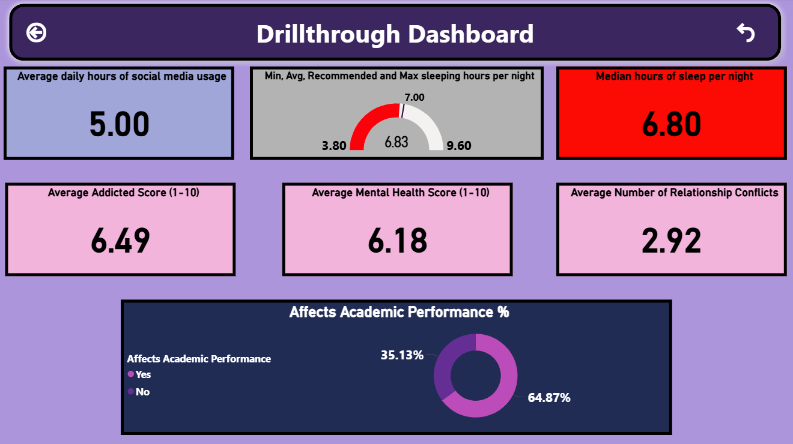
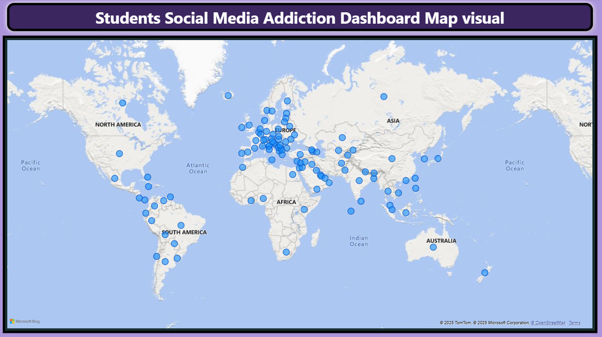
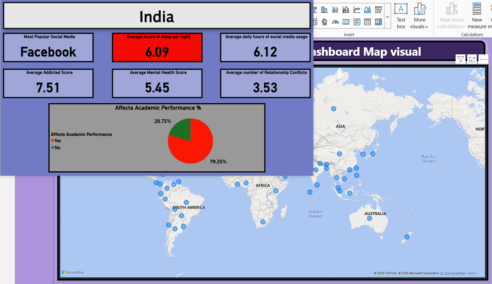
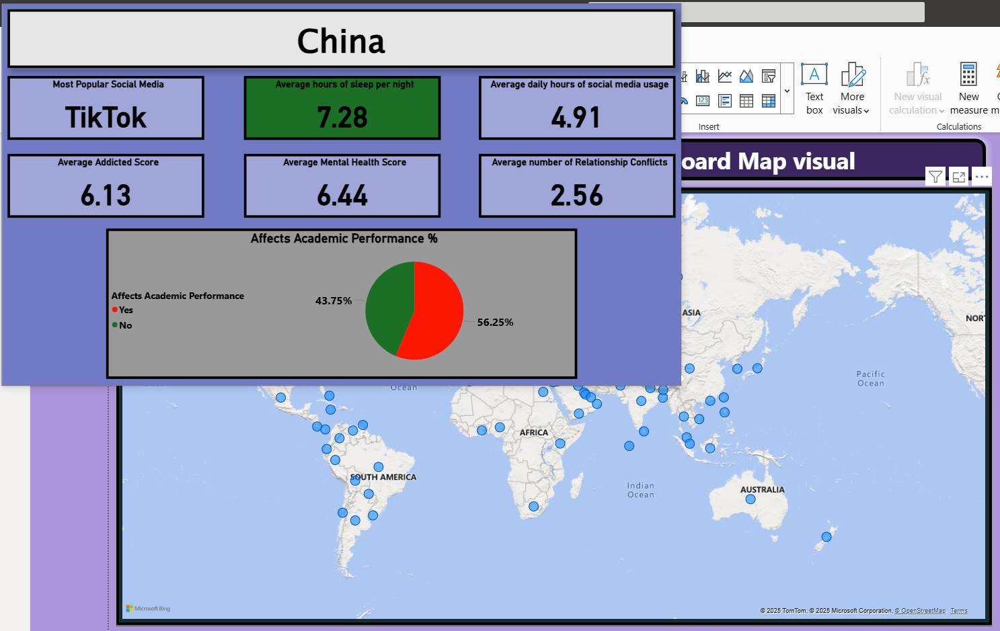

# 🎓 Student Social Media Addiction Analysis | Power BI Project

## 📘 Project Overview

This project presents an end-to-end **data analytics case study on student social media behavior**, built entirely in **Microsoft Power BI**.  
Using primary survey data collected in **Q1 2025**, the analysis explores how social media usage impacts **sleep, mental health, relationships, and academic performance** among students worldwide.

Designed to demonstrate expertise in **data cleaning, DAX modeling, KPI creation, and interactive dashboard design**, this project transforms raw survey responses into clear, actionable insights.

---

## 🎯 Key Objectives

- Quantify **average daily social media usage** among students.  
- Analyze the relationship between **screen time** and **sleep duration**.  
- Evaluate the impact of social media addiction on **mental health** and **academic performance**.  
- Build an **interactive Power BI dashboard** with dynamic drillthrough and tooltips for demographic exploration.

---

## 🧩 Dataset Summary

| Attribute | Description |
|------------|-------------|
| **Source** | One-time online survey (Q1 2025) |
| **Respondents** | Global student population |
| **Data Type** | Self-reported behavioral and demographic data |
| **Key Variables** | Age, Gender, Relationship Status, Academic Level, Daily Usage Hours, Sleep Hours, Addiction Score, Mental Health Score, Relationship Conflicts, Academic Impact |

---

## 📊 Dashboard Architecture

### **Page 1: Main Dashboard – Demographic Overview**
Provides a top-level overview of survey demographics and platform preferences.

**Components:**
- **Slicers:** Age | Gender | Relationship Status | Academic Level  
- **Visuals:**
  - Donut Chart → Age Distribution (%)  
  - Column Chart → Most Used Social Media Platforms (%)  
  - Pie Chart → Relationship Status (%)  
  - Bar Chart → Academic Level (%)  
  - Column Chart → Gender Distribution (%)
- **Drillthrough Button:** Navigates to detailed demographic analysis.

📸 *Attach Screenshot*  

---

### **Page 2: Drillthrough Analysis – Behavioral Insights**
In-depth behavioral metrics segmented by selected demographic attributes.

**Visuals:**
- **KPI Cards:**
  - Average Daily Social Media Usage  
  - Median Sleep Hours (Conditional Formatting: 🔴 <7 hrs, 🟢 ≥7 hrs)  
  - Average Addiction Score  
  - Average Mental Health Score  
  - Average Relationship Conflicts  
- **Gauge Chart:** Sleep Hours (min, avg, max, with 7-hour benchmark and color coding)  
- **Pie Chart:** Academic Performance Impact (% Yes/No)

📸 *Attach Screenshot*  

---

### **Page 3: Global View – Geographic Analysis**
Highlights country-level participation and engagement.

**Visuals:**
- Interactive **Map** of countries in dataset  
- **Tooltip Navigation:** Opens a detailed view for each country on hover

📸 *Attach Screenshot*  

---

### **Tooltip Page – Country-Level Summary**
Provides contextual insights when hovering over any country.

**Metrics Displayed:**
- Country  
- Most Used Platform  
- Average Sleep Hours (Conditional Formatting: 🔴 <7 hrs, 🟢 ≥7 hrs)  
- Average Daily Social Media Usage  
- Average Addiction Score  
- Average Mental Health Score  
- Average Relationship Conflicts  
- Academic Performance Impact (% Yes/No)

📸 *Attach Screenshot*  

---

## 🔍 Analytical Highlights

- Students spending **>5 hours/day** on social media reported **shorter sleep durations** and **higher addiction scores**.  
- **Sleep deprivation (<7 hrs)** correlates with **declining mental health and academic performance**.  
- **Relationship conflicts** show a positive trend with higher social media addiction scores.  
- Platform preferences vary significantly by **age group and academic level**.

---

## 🛠️ Tools & Skills Demonstrated

| Category | Tools / Skills |
|-----------|----------------|
| **Visualization & Reporting** | Microsoft Power BI |
| **Data Cleaning** | Power Query |
| **Data Modeling** | DAX (Data Analysis Expressions) |
| **KPI Design** | Custom measures, gauges, and conditional formatting |
| **Storytelling** | Drillthrough navigation, dynamic tooltips, demographic filters |
